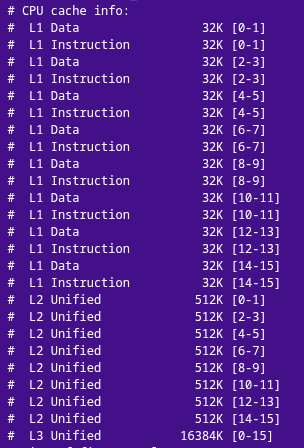
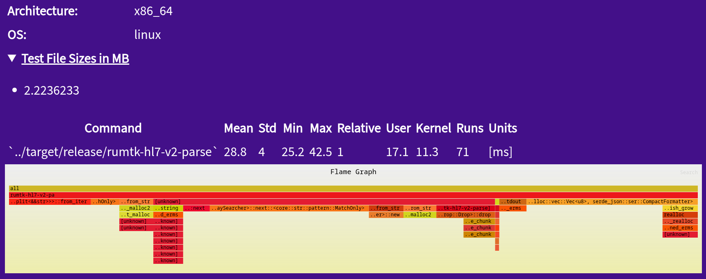

# Project HIFLAMES: Building a Bridge to the Future (Part 1)

## Articles in Series
[Project HIFLAMES: Building a Bridge to the Future (Part 1)](./intro.md)
[Project HIFLAMES: Building a Bridge to the Future (Part 2)](./methods.md)
[Project HIFLAMES: Building a Bridge to the Future (Part 3)](./results1.md)
[Project HIFLAMES: Building a Bridge to the Future (Part 4)](./results2.md)

## Introduction:
Over the following days and as we approach to the #SIIM26 Conference, we plan to release a series of reports showcasing our hypothesis, methodology, and results on our effort to build a better set of interfaces. We want to show you why you should consider MedicalMasses for your next system integration or FHIR upgrade at your Hospital.

If you enjoy our work, please, visit the following pages. Perhaps, consider financially supporting our effort at our OpenCollective page.

* OpenCollective: https://opencollective.com/medicalmasses-llc/projects/rumtk-v2

* Website: https://www.medicalmasses.com/

Without further ado, let's set the stage with our first report below!

## The Dream:
We have a dream of making an interface tool-set that is easy to use, performance-oriented, readily accessible, and faithful to the standards (HL7 V2 and FHIR).

## The Problem:
Many hours wasted diagnosing interface issues related to inadequate implementation of the HL7 V2 standard.

Inability of Hospitals and Healthcare Systems to upgrade to FHIR due to valuable legacy dependencies and legacy systems still using V2.

Slow and poor software everywhere and specially in Healthcare.

Inability to quickly and flexibly connect Machine Learning algorithms to the hospital infrastructure. Sometimes, this is due to fragility of the infrastructure itself. Other times, this happens due to lack of reliable pipes that ensure data is clean and valid.

## The Goal:
Our ultimate goal is to prove that investment in great engineering and great infrastructure will allow Healthcare Institutions to get data to where it needs to be. This should not be a step mired with friction. Furthermore, if we are to lower the cost of healthcare, a simple step is build strong foundations.

Imagine a world in which the ensemble of hospital systems work in unison. Imagine a world in which triage could be enhanced when the patient arrives because the data made it to your pre-screening algorithm. Imagine a world in which you do not see your healthcare infrastructure because it just works.

## Why Speed Matters:
An HL7 V2 message is a simple chunk of text. Your laptop's CPU can process large amounts of data and text before you even think of blinking. We can have (at a maximum) 1 ms processing of messages if we manage the CPU facilities properly.

Let's put this into perspective. A 1 ms parsing time enables you to process 1000 messages per second per CPU thread. Most consumer CPUs have many threads. Intel typically give you 8 performance threads. AMD give you 16 performance threads. 16 * 1000 = 16,000 messages. Now, scaling of processing is not quite linear and perfect due to complexities around competing resources, kernel task scheduling, and cache misses at the CPU level.

Let's say we do process at least 10,000 messages. 10,000 messages per second means we can process 1,000,000 messages in about 100 seconds. If an issue occurred synchronizing a system and you need to re-push messages, the process should take as long as your internal network bandwidth permits. The processing logic should not be a limiting factor in the total throughput of messages moving through your systems.

## Why Size Matters:
Your consumer grade CPU has circuitry for caching data. As long as you maximize work on a unit of data, processes execute in nanoseconds. CPU caches are divided into levels. These levels range from 1 to 3. Level 1 cache is usually 64 KB broken down into 32KB for data and 32KB for instructions. Level 1 caches are often allocated per CPU core. The level 2 and 3 caches are typically unified caches that tends to be large. Each cache level has a significant performance penalty as you go up in exchange for higher amounts of data.

Here is a nice article about the speed of caches. Also, Lenovo has a nice article overview about CPU caches which you can find here.

The significance of understanding these architectural nuances is that you can potentially process small messages (a few KB) in the time range of nanoseconds. This range is interesting but also optimistic. The vast majority of software vendors lack this institutional intuition and thus should not be held to this standard. However, 1 ms processing should be very attainable with a little attention to parsing strategy.

Here is an example of my laptop's CPU which provides the environment for testing.

Cache Configuration of Test System

## Conclusions:
We cannot control the size of a message, but we can implement the HL7 V2 parser such that the logic fits into the L1 instruction cache and minimize the need for data fetches (cache misses). Thus, in the typical message scenario (should be smaller than a few kilobytes) we should get maximum performance on initial passes. This should allow for plenty of room to run validation logic and even fill higher cache levels with the message parsing results. For now, we target a 1 ms parsing maximum time. We believe that faster processing than that should be possible, although more forethought is involved.

Our working hypothesis is that a simple parsing logic combined with leveraging a robust low-level language such as Rust will yield the fastest message processing implementation of HL7 V2. We believe no HL7 parser should take longer than 1 ms if the data structures and parsing algorithms are optimized for CPU caches.

The optimization target here will be to:

Minimize moving data (allocations and deallocations).

Pack the initial parsing, field validation, and object casting on the same underlying string. Meaning, maximize iterations on the same underlying array and minimize splitting of the array.

Test whether the input decoding to UTF-8 should happen before parsing or lazily on element content access.

## Preview:
In our next report, we will discuss our architectural strategy and the benefits of such an architecture. For now, here is a screenshot of a naive first implementation of the HL7 parser. Enjoy!

Mean Processing Time of a 2MB HL7 V2 Message
