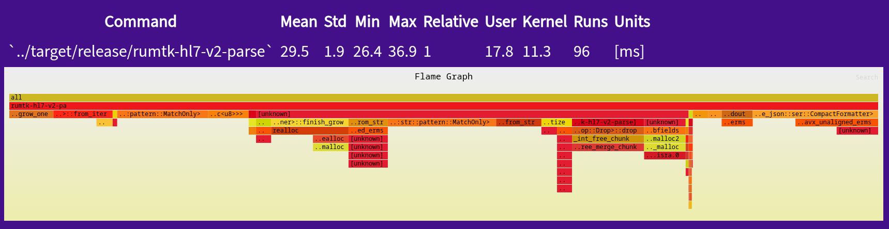

# Project HIFLAMES: Building a Bridge to the Future (Part 3)

## Articles in Series
* [Project HIFLAMES: Building a Bridge to the Future (Part 1)](./intro.md)
* [Project HIFLAMES: Building a Bridge to the Future (Part 2)](./methods.md)
* [Project HIFLAMES: Building a Bridge to the Future (Part 3)](./results1.md)
* [Project HIFLAMES: Building a Bridge to the Future (Part 4)](./results2.md)

## Important Links
* OpenCollective: https://opencollective.com/medicalmasses-llc/projects/rumtk-v2
* Website: https://www.medicalmasses.com/
* GiHub Repository: https://github.com/MedicalMasses-L-L-C/rumtk

## Introduction
Here we look at our semi-naive first attempt at parsing HL7 messages. The attempt is semi-naive because I focus on using stringviews as the primary data structure for iterating and splitting the incoming message. A StringView is essentially a container with a pointer to the string block but it itself does not own the underlying data. This structure tends to be lighter than the String object from which it is derived. Since it does not manages memory, it does not trigger allocation related events while enabling methods for acting and working with the underlying data. The downside is that each tokenized fragment we generate through parsing will then have to be copied to their own memory block so message components own the data slice.

In addition, we have a few areas in which we must generate vectors and maps to track repeating segments and fields. All of these things add to the allocation and copy burden of the program.

Remember, when we are dealing with millisecond and sub-millisecond time ranges, allocation operations become more costly. Part of the reason, as I soon noticed, is that it allows for kernel space to take control of execution. At that moment, it is not clear if the time is spent performing memory record keeping or other tasks such as scheduling other programs for execution. Keeping processing in user space as much as possible allows us to get a better idea of where the performance budget is getting spent.

## The Report
### Flamegraph


Mean Time [ms] Processing a 2MB Message

### CPU Statistics
```
# started on Tue May  5 10:39:07 2026


Performance counter stats for '../target/release/rumtk-hl7-v2-parse':

         2,816,607      cache-references:u                                                    
           168,746      cache-misses:u                                                        
        79,922,907      cycles:u                                                              
       231,579,397      instructions:u                                                        
        52,300,594      branches:u                                                            
             5,499      faults:u                                                              
                 0      migrations:u                                                          

       0.034143674 seconds time elapsed

       0.021979000 seconds user
       0.010978000 seconds sys
```

### CPU Info and Cache Budget Report
```
# ========
# captured on    : Tue May  5 10:39:08 2026
# header version : 1
# data offset    : 680
# data size      : 9536
# feat offset    : 10216
# hostname : fedora
# os release : 6.19.14-300.fc44.x86_64
# perf version : 6.19.14-300.fc44.x86_64
# arch : x86_64
# nrcpus online : 16
# nrcpus avail : 16
# cpudesc : AMD Ryzen 7 7730U with Radeon Graphics
# cpuid : AuthenticAMD,25,80,0
# total memory : 39942832 kB
# cmdline : /usr/bin/perf
# event : name = cache-misses:u, , id = { 283, 284, 285, 286, 287, 288, 289, 290, 291, 292, 293, 294, 295, 296, 297, 298 }, type = 4 (cpu), size = 144, config = 0x964 (cache-misses), { sample_period, sample_freq } = 4000, sample_type = IP|TID|TIME|ID|PERIOD, read_format = TOTAL_TIME_ENABLED|TOTAL_TIME_RUNNING|ID|LOST, disabled = 1, inherit = 1, exclude_kernel = 1, exclude_hv = 1, mmap = 1, comm = 1, freq = 1, inherit_stat = 1, enable_on_exec = 1, task = 1, sample_id_all = 1, mmap2 = 1, comm_exec = 1, ksymbol = 1, bpf_event = 1, build_id = 1
# event : name = branch-misses:u, , id = { 299, 300, 301, 302, 303, 304, 305, 306, 307, 308, 309, 310, 311, 312, 313, 314 }, type = 4 (cpu), size = 144, config = 0xc3 (ex_ret_brn_misp), { sample_period, sample_freq } = 4000, sample_type = IP|TID|TIME|ID|PERIOD, read_format = TOTAL_TIME_ENABLED|TOTAL_TIME_RUNNING|ID|LOST, disabled = 1, inherit = 1, exclude_kernel = 1, exclude_hv = 1, freq = 1, inherit_stat = 1, enable_on_exec = 1, sample_id_all = 1
# sibling sockets : 0-15
# sibling dies    : 0-15
# sibling threads : 0-1
# sibling threads : 2-3
# sibling threads : 4-5
# sibling threads : 6-7
# sibling threads : 8-9
# sibling threads : 10-11
# sibling threads : 12-13
# sibling threads : 14-15
# CPU 0: Core ID 0, Die ID 0, Socket ID 0
# CPU 1: Core ID 0, Die ID 0, Socket ID 0
# CPU 2: Core ID 1, Die ID 0, Socket ID 0
# CPU 3: Core ID 1, Die ID 0, Socket ID 0
# CPU 4: Core ID 2, Die ID 0, Socket ID 0
# CPU 5: Core ID 2, Die ID 0, Socket ID 0
# CPU 6: Core ID 3, Die ID 0, Socket ID 0
# CPU 7: Core ID 3, Die ID 0, Socket ID 0
# CPU 8: Core ID 4, Die ID 0, Socket ID 0
# CPU 9: Core ID 4, Die ID 0, Socket ID 0
# CPU 10: Core ID 5, Die ID 0, Socket ID 0
# CPU 11: Core ID 5, Die ID 0, Socket ID 0
# CPU 12: Core ID 6, Die ID 0, Socket ID 0
# CPU 13: Core ID 6, Die ID 0, Socket ID 0
# CPU 14: Core ID 7, Die ID 0, Socket ID 0
# CPU 15: Core ID 7, Die ID 0, Socket ID 0
# node0 meminfo  : total = 15444316 kB, free = 310600 kB
# node0 cpu list : 0-15
# node1 meminfo  : total = 24498516 kB, free = 13082960 kB
# node1 cpu list : -1
# pmu mappings: cpu = 4, amd_df = 12, amd_iommu_0 = 14, amd_l3 = 13, breakpoint = 5, drm_amdgpu = 4294836224, hwmon_ac = 4294901760, hwmon_acpitz = 4294901761, hwmon_amdgpu = 4294901764, hwmon_bat0 = 4294901762, hwmon_k10temp = 4294901765, hwmon_nvme = 4294901763, hwmon_thinkpad = 4294901766, ibs_fetch = 10, ibs_op = 11, kprobe = 8, msr = 15, power = 16, power_core = 17, software = 1, tool = 4294967294, tracepoint = 2, uprobe = 9
# CPU cache info:
#  L1 Data                 32K [0-1]
#  L1 Instruction          32K [0-1]
#  L1 Data                 32K [2-3]
#  L1 Instruction          32K [2-3]
#  L1 Data                 32K [4-5]
#  L1 Instruction          32K [4-5]
#  L1 Data                 32K [6-7]
#  L1 Instruction          32K [6-7]
#  L1 Data                 32K [8-9]
#  L1 Instruction          32K [8-9]
#  L1 Data                 32K [10-11]
#  L1 Instruction          32K [10-11]
#  L1 Data                 32K [12-13]
#  L1 Instruction          32K [12-13]
#  L1 Data                 32K [14-15]
#  L1 Instruction          32K [14-15]
#  L2 Unified             512K [0-1]
#  L2 Unified             512K [2-3]
#  L2 Unified             512K [4-5]
#  L2 Unified             512K [6-7]
#  L2 Unified             512K [8-9]
#  L2 Unified             512K [10-11]
#  L2 Unified             512K [12-13]
#  L2 Unified             512K [14-15]
#  L3 Unified           16384K [0-15]
# time of first sample : 68376.152303
# time of last sample : 68376.180821
# sample duration :     28.518 ms
# memory nodes (nr 2, block size 0x8000000):
#    0 [15G]: 198-317
#    1 [24G]: 0-25,32-197
# bpf_prog_info empty
# btf info empty
# cpu pmu capabilities: max_precise=0
# AMD systems uses ibs_op// PMU for some precise events, e.g.: cycles:p, see the 'perf list' man page for further details.
# missing features: TRACING_DATA BUILD_ID BRANCH_STACK GROUP_DESC AUXTRACE STAT CLOCKID DIR_FORMAT COMPRESSED CLOCK_DATA HYBRID_TOPOLOGY
# ========
#
#
# Total Lost Samples: 0
#
# Samples: 78  of event 'cache-misses:u'
# Event count (approx.): 131531
#
# Overhead  Command          Shared Object                                                              Symbol
# ........  ...............  .........................................................................  ......................................................................................................................................................................................................
#
    13.65%  rumtk-hl7-v2-pa  /usr/lib64/libc.so.6                                                       0x14b973           B [.] __memmove_avx_unaligned_erms
     8.89%  rumtk-hl7-v2-pa  [unknown]                                                                  0xffffffff86a01280 ! [k] 0xffffffff86a01280
     8.45%  rumtk-hl7-v2-pa  /usr/lib64/libc.so.6                                                       0x8033e            B [.] _int_free_create_chunk
     6.10%  rumtk-hl7-v2-pa  /home/kiseitai2/RustroverProjects/rumtk/target/release/rumtk-hl7-v2-parse  0x9831f            B [.] <core::str::pattern::TwoWaySearcher>::next::<core::str::pattern::MatchOnly>
     6.04%  rumtk-hl7-v2-pa  /home/kiseitai2/RustroverProjects/rumtk/target/release/rumtk-hl7-v2-parse  0x963eb            B [.] <rumtk_hl7_v2::hl7_v2_parser::v2_parser::V2Message>::sanitize
     5.25%  rumtk-hl7-v2-pa  /usr/lib64/libc.so.6                                                       0x8027b            B [.] unlink_chunk.isra.0
     5.11%  rumtk-hl7-v2-pa  /home/kiseitai2/RustroverProjects/rumtk/target/release/rumtk-hl7-v2-parse  0x133e4d           B [.] core::slice::memchr::memrchr
     4.74%  rumtk-hl7-v2-pa  /usr/lib64/libc.so.6                                                       0x82647            B [.] _int_malloc
     4.65%  rumtk-hl7-v2-pa  /home/kiseitai2/RustroverProjects/rumtk/target/release/rumtk-hl7-v2-parse  0x91358            B [.] <alloc::vec::Vec<alloc::vec::Vec<rumtk_hl7_v2::hl7_v2_parser::v2_parser::V2Field>> as core::ops::drop::Drop>::drop
     3.71%  rumtk-hl7-v2-pa  /usr/lib64/libc.so.6                                                       0x814c5            B [.] _int_free_merge_chunk
     3.57%  rumtk-hl7-v2-pa  /home/kiseitai2/RustroverProjects/rumtk/target/release/rumtk-hl7-v2-parse  0x91720            B [.] __rustc::__rust_dealloc
     3.10%  rumtk-hl7-v2-pa  /home/kiseitai2/RustroverProjects/rumtk/target/release/rumtk-hl7-v2-parse  0x84340            B [.] serde_json::ser::format_escaped_str::<&mut alloc::vec::Vec<u8>, serde_json::ser::CompactFormatter>
     2.95%  rumtk-hl7-v2-pa  /usr/lib64/ld-linux-x86-64.so.2                                            0x5399             B [.] call_init
     2.87%  rumtk-hl7-v2-pa  [unknown]                                                                  0xffffffff86da6a3e ! [k] 0xffffffff86da6a3e
     2.14%  rumtk-hl7-v2-pa  [unknown]                                                                  0xffffffff86a00005 ! [k] 0xffffffff86a00005
     2.02%  rumtk-hl7-v2-pa  /home/kiseitai2/RustroverProjects/rumtk/target/release/rumtk-hl7-v2-parse  0x9996d            B [.] <core::str::iter::Split<char> as core::iter::traits::iterator::Iterator>::next
     2.00%  rumtk-hl7-v2-pa  [unknown]                                                                  0xffffffff86a01284 ! [k] 0xffffffff86a01284
     1.89%  rumtk-hl7-v2-pa  /home/kiseitai2/RustroverProjects/rumtk/target/release/rumtk-hl7-v2-parse  0x96235            B [.] <rumtk_hl7_v2::hl7_v2_parser::v2_parser::V2Message>::tokenize_segments
     1.84%  rumtk-hl7-v2-pa  /usr/lib64/libc.so.6                                                       0x6f67f            B [.] _dlerror_run
     1.68%  rumtk-hl7-v2-pa  /usr/lib64/libc.so.6                                                       0x81613            B [.] _int_free_chunk
     1.67%  rumtk-hl7-v2-pa  [unknown]                                                                  0xffffffff86b04104 ! [k] 0xffffffff86b04104
     1.45%  rumtk-hl7-v2-pa  /home/kiseitai2/RustroverProjects/rumtk/target/release/rumtk-hl7-v2-parse  0x99416            B [.] <alloc::vec::Vec<&str> as alloc::vec::spec_from_iter_nested::SpecFromIterNested<&str, core::str::iter::Split<&&str>>>::from_iter
     1.41%  rumtk-hl7-v2-pa  /home/kiseitai2/RustroverProjects/rumtk/target/release/rumtk-hl7-v2-parse  0x85e98            B [.] <serde_json::ser::Compound<&mut alloc::vec::Vec<u8>, serde_json::ser::CompactFormatter> as serde_core::ser::SerializeMap>::serialize_entry::<str, compact_str::CompactString>


# Samples: 79  of event 'branch-misses:u'
# Event count (approx.): 78996
#
# Overhead  Command          Shared Object                                                              Symbol
# ........  ...............  .........................................................................  ..................................................................................................................................................................................................................................................................................
#
    17.52%  rumtk-hl7-v2-pa  /home/kiseitai2/RustroverProjects/rumtk/target/release/rumtk-hl7-v2-parse  0x9947f            B [.] <alloc::vec::Vec<&str> as alloc::vec::spec_from_iter_nested::SpecFromIterNested<&str, core::str::iter::Split<&&str>>>::from_iter
    12.84%  rumtk-hl7-v2-pa  /home/kiseitai2/RustroverProjects/rumtk/target/release/rumtk-hl7-v2-parse  0x98380            B [.] <core::str::pattern::TwoWaySearcher>::next::<core::str::pattern::MatchOnly>
     9.51%  rumtk-hl7-v2-pa  /home/kiseitai2/RustroverProjects/rumtk/target/release/rumtk-hl7-v2-parse  0x842ee            B [.] serde_json::ser::format_escaped_str::<&mut alloc::vec::Vec<u8>, serde_json::ser::CompactFormatter>
     5.36%  rumtk-hl7-v2-pa  /usr/lib64/libc.so.6                                                       0x14b144           B [.] __memcmp_avx2_movbe
     4.97%  rumtk-hl7-v2-pa  /usr/lib64/libc.so.6                                                       0x83eeb            B [.] malloc
     4.21%  rumtk-hl7-v2-pa  [unknown]                                                                  0xffffffff86a01280 ! [k] 0xffffffff86a01280
     4.02%  rumtk-hl7-v2-pa  /home/kiseitai2/RustroverProjects/rumtk/target/release/rumtk-hl7-v2-parse  0x85ba4            B [.] <serde_json::ser::Compound<&mut alloc::vec::Vec<u8>, serde_json::ser::CompactFormatter> as serde_core::ser::SerializeMap>::serialize_entry::<str, alloc::vec::Vec<rumtk_hl7_v2::hl7_v2_parser::v2_parser::V2Component>>
     3.78%  rumtk-hl7-v2-pa  /home/kiseitai2/RustroverProjects/rumtk/target/release/rumtk-hl7-v2-parse  0x1325f4           B [.] <core::str::pattern::StrSearcher>::new
     3.28%  rumtk-hl7-v2-pa  /home/kiseitai2/RustroverProjects/rumtk/target/release/rumtk-hl7-v2-parse  0x133d6a           B [.] core::slice::memchr::memchr_aligned
     3.27%  rumtk-hl7-v2-pa  /home/kiseitai2/RustroverProjects/rumtk/target/release/rumtk-hl7-v2-parse  0x99fc3            B [.] <core::str::pattern::StrSearcher as core::str::pattern::Searcher>::next_match
     3.23%  rumtk-hl7-v2-pa  /usr/lib64/libc.so.6                                                       0x829ef            B [.] _int_malloc
     2.51%  rumtk-hl7-v2-pa  /usr/lib64/libc.so.6                                                       0x814c5            B [.] _int_free_merge_chunk
     2.38%  rumtk-hl7-v2-pa  /home/kiseitai2/RustroverProjects/rumtk/target/release/rumtk-hl7-v2-parse  0x858cc            B [.] <serde_json::ser::Compound<&mut alloc::vec::Vec<u8>, serde_json::ser::CompactFormatter> as serde_core::ser::SerializeMap>::serialize_entry::<str, alloc::vec::Vec<alloc::vec::Vec<rumtk_hl7_v2::hl7_v2_parser::v2_parser::V2Field>>>
     2.23%  rumtk-hl7-v2-pa  /home/kiseitai2/RustroverProjects/rumtk/target/release/rumtk-hl7-v2-parse  0x9c4df            B [.] <once_cell::race::once_box::OnceBox<[[u64; 4]; 2]>>::init::<<once_cell::race::once_box::OnceBox<_>>::get_or_init::Void, <once_cell::race::once_box::OnceBox<[[u64; 4]; 2]>>::get_or_init<ahash::random_state::get_fixed_seeds::{closure#0}>::{closure#0}>
     2.18%  rumtk-hl7-v2-pa  /home/kiseitai2/RustroverProjects/rumtk/target/release/rumtk-hl7-v2-parse  0x9d37d            B [.] rumtk_core::cli::cli_utils::read_some_stdin
     2.12%  rumtk-hl7-v2-pa  /home/kiseitai2/RustroverProjects/rumtk/target/release/rumtk-hl7-v2-parse  0x98233            B [.] <phf::map::Map<&str, u8>>::get_entry::<str>
     1.86%  rumtk-hl7-v2-pa  /home/kiseitai2/RustroverProjects/rumtk/target/release/rumtk-hl7-v2-parse  0x963bb            B [.] <rumtk_hl7_v2::hl7_v2_parser::v2_parser::V2Message>::sanitize
     1.61%  rumtk-hl7-v2-pa  /home/kiseitai2/RustroverProjects/rumtk/target/release/rumtk-hl7-v2-parse  0x876e1            B [.] <rumtk_hl7_v2::hl7_v2_parser::v2_parser::V2Component as serde_core::ser::Serialize>::serialize::<&mut serde_json::ser::Serializer<&mut alloc::vec::Vec<u8>>>
     1.51%  rumtk-hl7-v2-pa  /home/kiseitai2/RustroverProjects/rumtk/target/release/rumtk-hl7-v2-parse  0x94182            B [.] <rumtk_hl7_v2::hl7_v2_parser::v2_parser::V2Field>::from_str
     1.34%  rumtk-hl7-v2-pa  [unknown]                                                                  0xffffffff8726de63 ! [k] 0xffffffff8726de63
     1.30%  rumtk-hl7-v2-pa  /home/kiseitai2/RustroverProjects/rumtk/target/release/rumtk-hl7-v2-parse  0x912ba            B [.] <alloc::vec::Vec<alloc::vec::Vec<rumtk_hl7_v2::hl7_v2_parser::v2_parser::V2Field>> as core::ops::drop::Drop>::drop
     1.28%  rumtk-hl7-v2-pa  /home/kiseitai2/RustroverProjects/rumtk/target/release/rumtk-hl7-v2-parse  0x786eb            B [.] __do_global_dtors_aux
     1.24%  rumtk-hl7-v2-pa  /home/kiseitai2/RustroverProjects/rumtk/target/release/rumtk-hl7-v2-parse  0x94503            B [.] <rumtk_hl7_v2::hl7_v2_parser::v2_parser::V2Segment>::generate_subfields
     1.21%  rumtk-hl7-v2-pa  [unknown]                                                                  0xffffffff87165a56 ! [k] 0xffffffff87165a56
     1.09%  rumtk-hl7-v2-pa  /usr/lib64/libc.so.6                                                       0x8033e            B [.] _int_free_create_chunk
     1.03%  rumtk-hl7-v2-pa  /home/kiseitai2/RustroverProjects/rumtk/target/release/rumtk-hl7-v2-parse  0x86e88            B [.] <rumtk_hl7_v2::hl7_v2_parser::v2_parser::V2Field as serde_core::ser::Serialize>::serialize::<&mut serde_json::ser::Serializer<&mut alloc::vec::Vec<u8>>>
     1.00%  rumtk-hl7-v2-pa  [unknown]                                                                  0xffffffff880e5b1f ! [k] 0xffffffff880e5b1f


#
# (Tip: If you prefer Intel style assembly, try: perf annotate -M intel)
#
```

## Results
The parser tool has a simple workflow. It reads a message from standard input, performs a basic parsing pass in which it splits the input into segments, fileds, and components, cast the result to JSON, and writes the JSON back out through standard out.

For our naive attempt, the parser takes about 29.5 ms on average to run with a standard deviation of 1.9 ms. Of note is that the worst time reported for parsing was 36.9 ms. This translates into 27 2MB messages per second in the worst case. The processing is divided into 17.8 ms (60.34%) in user space and 11.3 ms (38.31%) in kernel or system space.

The flamegraph gives you an idea of a few areas where the program spends its time. It looks like a combination of searches, allocations, and encoding to JSON. Searching for delimiters took 22.92% of the execution time. Allocations took 30.11% of the time. Encoding to JSON took 19.11% of the time. The rest was broken into many other chunks including 8.30% of the time spent deallocating some of the items.

The CPU statistics summary report shows that the program had 168,746 cache misses out of 2,816,607 cache operations or about 6% cache misses. Parsing took 79,922,907 CPU cycles and it experienced 5,499 page faults. Parsing used 231,579,397 instructions and generated 52,300,594 branches.

The last part of the report tells us that searching and memory moves generated most of the cache misses. Branching burden comes from searching and generating vectors of split strings.

## Discussion
An average processing rate of 27 2MB messages per thread per second is not bad for a naive attempt and certainly beyond the capabilities of vendor implementations known to us. However, for engineers like those found in MedicalMasses L.L.C., it is not impressive. For starters, there is a large burden of memory allocations creating vectors which makes sense because segments should generate at least 2059 item insertions into the vector in addition to field and component splitting. This burden could be lessen with a pre-allocation strategy instead to minimize targeting the heap and creating heap fragmentation that then has to be managed. In addition, each allocation event is an opportunity for kernel space to claim control of execution further worsening the total time for processing.

Another source of slowness is the encoding to JSON. In the Rust ecosystem, Serde is a well supported library for generating data encodings using an intermediate representation. Unfortunately, this library is so common that many other dependencies support it right out of the box limiting our ability to try other, more optimal approaches. Furthermore, the slowness here is mostly an issue when creating Unix pipelines and should be less of a concern for situations in which the framework is used as a library for parsing as part of a larger project.

Overall, cache misses weren't as big a factor as I originally thought, but allocations and searching took a larger portion of the time. As a result, we thus focus on minimizing allocation events and decreasing how long we search. The good news is that Rust is already good at finding opportunities to apply other optimizations techniques such as SIMD instructions/intrinsics during searching and memory operations. Our focus up next is, therefore, on finding opportunities to minimize copying and in-lining searching.