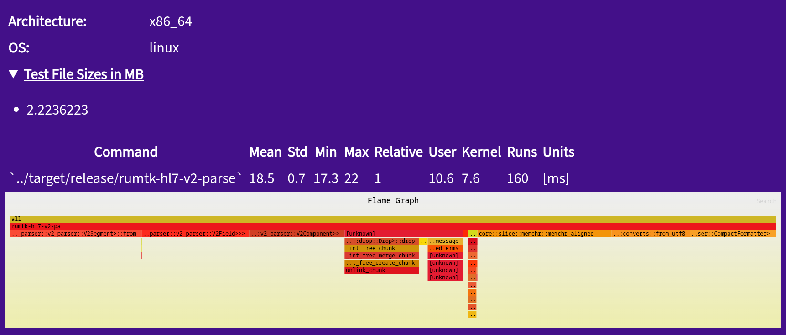

# Project HIFLAMES: Building a Bridge to the Future (Part 4)

## Articles in Series
* [Project HIFLAMES: Building a Bridge to the Future (Part 1)](./intro.md)
* [Project HIFLAMES: Building a Bridge to the Future (Part 2)](./methods.md)
* [Project HIFLAMES: Building a Bridge to the Future (Part 3)](./results1.md)
* [Project HIFLAMES: Building a Bridge to the Future (Part 4)](./results2.md)

## Important Links
* OpenCollective: https://opencollective.com/medicalmasses-llc/projects/rumtk-v2
* Website: https://www.medicalmasses.com/
* GiHub Repository: https://github.com/MedicalMasses-L-L-C/rumtk

## Introduction

Our naive attempt was pretty good and it is clear that Rust optimizes a large number of things via LLVM. For example, 
Rust does an excellent job at introducing SIMD in a few key areas. A mean parsing time of 29.5 ms for a 2MB is incredibly
fast relative to current implementations of V2 I have seen on the market. However, the maximum of 36.9 ms reminds us that 
for any given 2MB (ORU) message we could be parsing at a rate of 27 messages per second per thread which is not great.

As a result, I looked at optimizing this further during the SIIM Hackathon. I looked at using a lower level data structure 
to operate at the byte level and implementing SIMD intrinsics to quickly search for a terminator and tokenize the input 
message.

## The Report
### Flamegraph


Mean Time [ms] Processing a 2MB Message

### CPU Statistics
```
# started on Tue Jun 16 13:46:53 2026


 Performance counter stats for '../target/release/rumtk-hl7-v2-parse':

         1,786,833      cache-references:u                                                    
            83,806      cache-misses:u                                                        
        44,525,432      cycles:u                                                              
       125,220,643      instructions:u                                                        
        25,395,758      branches:u                                                            
             3,586      faults:u                                                              
                 0      migrations:u                                                          

       0.022085272 seconds time elapsed

       0.011998000 seconds user
       0.008966000 seconds sys
```

### CPU Info and Cache Budget Report
```
# ========
# captured on    : Tue Jun 16 13:46:53 2026
# header version : 1
# data offset    : 680
# data size      : 6992
# feat offset    : 7672
# hostname : fedora
# os release : 7.0.12-201.fc44.x86_64
# perf version : 7.0.12-201.fc44.x86_64
# arch : x86_64
# nrcpus online : 16
# nrcpus avail : 16
# cpudesc : AMD Ryzen 7 7730U with Radeon Graphics
# cpuid : AuthenticAMD,25,80,0
# total memory : 39942488 kB
# cmdline : /usr/bin/perf 
# event : name = cache-misses:u, , id = { 431, 432, 433, 434, 435, 436, 437, 438, 439, 440, 441, 442, 443, 444, 445, 446 }, type = 4 (cpu), size = 144, config = 0x964 (cache-misses), { sample_period, sample_freq } = 4000, sample_type = IP|TID|TIME|ID|PERIOD, read_format = TOTAL_TIME_ENABLED|TOTAL_TIME_RUNNING|ID|LOST, disabled = 1, inherit = 1, exclude_kernel = 1, exclude_hv = 1, mmap = 1, comm = 1, freq = 1, inherit_stat = 1, enable_on_exec = 1, task = 1, sample_id_all = 1, mmap2 = 1, comm_exec = 1, ksymbol = 1, bpf_event = 1, build_id = 1
# event : name = branch-misses:u, , id = { 447, 448, 449, 450, 451, 452, 453, 454, 455, 456, 457, 458, 459, 460, 461, 462 }, type = 4 (cpu), size = 144, config = 0xc3 (ex_ret_brn_misp), { sample_period, sample_freq } = 4000, sample_type = IP|TID|TIME|ID|PERIOD, read_format = TOTAL_TIME_ENABLED|TOTAL_TIME_RUNNING|ID|LOST, disabled = 1, inherit = 1, exclude_kernel = 1, exclude_hv = 1, freq = 1, inherit_stat = 1, enable_on_exec = 1, sample_id_all = 1
# sibling sockets : 0-15
# sibling dies    : 0-15
# sibling threads : 0-1
# sibling threads : 2-3
# sibling threads : 4-5
# sibling threads : 6-7
# sibling threads : 8-9
# sibling threads : 10-11
# sibling threads : 12-13
# sibling threads : 14-15
# CPU 0: Core ID 0, Die ID 0, Socket ID 0
# CPU 1: Core ID 0, Die ID 0, Socket ID 0
# CPU 2: Core ID 1, Die ID 0, Socket ID 0
# CPU 3: Core ID 1, Die ID 0, Socket ID 0
# CPU 4: Core ID 2, Die ID 0, Socket ID 0
# CPU 5: Core ID 2, Die ID 0, Socket ID 0
# CPU 6: Core ID 3, Die ID 0, Socket ID 0
# CPU 7: Core ID 3, Die ID 0, Socket ID 0
# CPU 8: Core ID 4, Die ID 0, Socket ID 0
# CPU 9: Core ID 4, Die ID 0, Socket ID 0
# CPU 10: Core ID 5, Die ID 0, Socket ID 0
# CPU 11: Core ID 5, Die ID 0, Socket ID 0
# CPU 12: Core ID 6, Die ID 0, Socket ID 0
# CPU 13: Core ID 6, Die ID 0, Socket ID 0
# CPU 14: Core ID 7, Die ID 0, Socket ID 0
# CPU 15: Core ID 7, Die ID 0, Socket ID 0
# node0 meminfo  : total = 15444312 kB, free = 618764 kB
# node0 cpu list : 0-15
# node1 meminfo  : total = 24498176 kB, free = 13125320 kB
# node1 cpu list : -1
# pmu mappings: cpu = 4, amd_df = 12, amd_iommu_0 = 14, amd_l3 = 13, breakpoint = 5, drm_amdgpu = 4294836224, hwmon_ac = 4294901760, hwmon_acpitz = 4294901761, hwmon_amdgpu = 4294901764, hwmon_bat0 = 4294901762, hwmon_k10temp = 4294901765, hwmon_nvme = 4294901763, hwmon_thinkpad = 4294901766, ibs_fetch = 10, ibs_op = 11, kprobe = 8, msr = 15, power = 16, power_core = 17, software = 1, tool = 4294967294, tracepoint = 2, uprobe = 9
# CPU cache info:
#  L1 Data                 32K [0-1]
#  L1 Instruction          32K [0-1]
#  L1 Data                 32K [2-3]
#  L1 Instruction          32K [2-3]
#  L1 Data                 32K [4-5]
#  L1 Instruction          32K [4-5]
#  L1 Data                 32K [6-7]
#  L1 Instruction          32K [6-7]
#  L1 Data                 32K [8-9]
#  L1 Instruction          32K [8-9]
#  L1 Data                 32K [10-11]
#  L1 Instruction          32K [10-11]
#  L1 Data                 32K [12-13]
#  L1 Instruction          32K [12-13]
#  L1 Data                 32K [14-15]
#  L1 Instruction          32K [14-15]
#  L2 Unified             512K [0-1]
#  L2 Unified             512K [2-3]
#  L2 Unified             512K [4-5]
#  L2 Unified             512K [6-7]
#  L2 Unified             512K [8-9]
#  L2 Unified             512K [10-11]
#  L2 Unified             512K [12-13]
#  L2 Unified             512K [14-15]
#  L3 Unified           16384K [0-15]
# time of first sample : 256740.148089
# time of last sample : 256740.168234
# sample duration :     20.144 ms
# memory nodes (nr 2, block size 0x8000000):
#    0 [15G]: 198-317
#    1 [24G]: 0-25,32-197
# bpf_prog_info empty
# btf info empty
# cpu pmu capabilities: max_precise=0
# AMD systems uses ibs_op// PMU for some precise events, e.g.: cycles:p, see the 'perf list' man page for further details.
# schedstat version	: 17
# Maximum sched domains	: 2
# cpu		: 0
# nr_domains	: 2
# Domain		: 0
# Domain name      : SMT
# Domain cpu map   : 0003
# Domain cpu list  : 0-1
# Domain		: 1
# Domain name      : MC
# Domain cpu map   : ffff
# Domain cpu list  : 0-15
# cpu		: 1
# nr_domains	: 2
# Domain		: 0
# Domain name      : SMT
# Domain cpu map   : 0003
# Domain cpu list  : 0-1
# Domain		: 1
# Domain name      : MC
# Domain cpu map   : ffff
# Domain cpu list  : 0-15
# cpu		: 2
# nr_domains	: 2
# Domain		: 0
# Domain name      : SMT
# Domain cpu map   : 000c
# Domain cpu list  : 2-3
# Domain		: 1
# Domain name      : MC
# Domain cpu map   : ffff
# Domain cpu list  : 0-15
# cpu		: 3
# nr_domains	: 2
# Domain		: 0
# Domain name      : SMT
# Domain cpu map   : 000c
# Domain cpu list  : 2-3
# Domain		: 1
# Domain name      : MC
# Domain cpu map   : ffff
# Domain cpu list  : 0-15
# cpu		: 4
# nr_domains	: 2
# Domain		: 0
# Domain name      : SMT
# Domain cpu map   : 0030
# Domain cpu list  : 4-5
# Domain		: 1
# Domain name      : MC
# Domain cpu map   : ffff
# Domain cpu list  : 0-15
# cpu		: 5
# nr_domains	: 2
# Domain		: 0
# Domain name      : SMT
# Domain cpu map   : 0030
# Domain cpu list  : 4-5
# Domain		: 1
# Domain name      : MC
# Domain cpu map   : ffff
# Domain cpu list  : 0-15
# cpu		: 6
# nr_domains	: 2
# Domain		: 0
# Domain name      : SMT
# Domain cpu map   : 00c0
# Domain cpu list  : 6-7
# Domain		: 1
# Domain name      : MC
# Domain cpu map   : ffff
# Domain cpu list  : 0-15
# cpu		: 7
# nr_domains	: 2
# Domain		: 0
# Domain name      : SMT
# Domain cpu map   : 00c0
# Domain cpu list  : 6-7
# Domain		: 1
# Domain name      : MC
# Domain cpu map   : ffff
# Domain cpu list  : 0-15
# cpu		: 8
# nr_domains	: 2
# Domain		: 0
# Domain name      : SMT
# Domain cpu map   : 0300
# Domain cpu list  : 8-9
# Domain		: 1
# Domain name      : MC
# Domain cpu map   : ffff
# Domain cpu list  : 0-15
# cpu		: 9
# nr_domains	: 2
# Domain		: 0
# Domain name      : SMT
# Domain cpu map   : 0300
# Domain cpu list  : 8-9
# Domain		: 1
# Domain name      : MC
# Domain cpu map   : ffff
# Domain cpu list  : 0-15
# cpu		: 10
# nr_domains	: 2
# Domain		: 0
# Domain name      : SMT
# Domain cpu map   : 0c00
# Domain cpu list  : 10-11
# Domain		: 1
# Domain name      : MC
# Domain cpu map   : ffff
# Domain cpu list  : 0-15
# cpu		: 11
# nr_domains	: 2
# Domain		: 0
# Domain name      : SMT
# Domain cpu map   : 0c00
# Domain cpu list  : 10-11
# Domain		: 1
# Domain name      : MC
# Domain cpu map   : ffff
# Domain cpu list  : 0-15
# cpu		: 12
# nr_domains	: 2
# Domain		: 0
# Domain name      : SMT
# Domain cpu map   : 3000
# Domain cpu list  : 12-13
# Domain		: 1
# Domain name      : MC
# Domain cpu map   : ffff
# Domain cpu list  : 0-15
# cpu		: 13
# nr_domains	: 2
# Domain		: 0
# Domain name      : SMT
# Domain cpu map   : 3000
# Domain cpu list  : 12-13
# Domain		: 1
# Domain name      : MC
# Domain cpu map   : ffff
# Domain cpu list  : 0-15
# cpu		: 14
# nr_domains	: 2
# Domain		: 0
# Domain name      : SMT
# Domain cpu map   : c000
# Domain cpu list  : 14-15
# Domain		: 1
# Domain name      : MC
# Domain cpu map   : ffff
# Domain cpu list  : 0-15
# cpu		: 15
# nr_domains	: 2
# Domain		: 0
# Domain name      : SMT
# Domain cpu map   : c000
# Domain cpu list  : 14-15
# Domain		: 1
# Domain name      : MC
# Domain cpu map   : ffff
# Domain cpu list  : 0-15
# e_machine : 62
#   e_flags : 0
# missing features: TRACING_DATA BUILD_ID BRANCH_STACK GROUP_DESC AUXTRACE STAT CLOCKID DIR_FORMAT COMPRESSED CLOCK_DATA HYBRID_TOPOLOGY 
# ========
#
#
# Total Lost Samples: 0
#
# Samples: 58  of event 'cache-misses:u'
# Event count (approx.): 81102
#
# Overhead  Command          Shared Object                                                              Symbol                                                                                                                                                                                                                                                                                                         
# ........  ...............  .........................................................................  ...............................................................................................................................................................................................................................................................................................................
#
    19.30%  rumtk-hl7-v2-pa  /home/kiseitai2/RustroverProjects/rumtk/target/release/rumtk-hl7-v2-parse  0x78cc7            B [.] serde_json::ser::format_escaped_str::<&mut alloc::vec::Vec<u8>, serde_json::ser::CompactFormatter>
    10.93%  rumtk-hl7-v2-pa  /usr/lib64/libc.so.6                                                       0x14a525           B [.] __memmove_avx_unaligned_erms
     6.80%  rumtk-hl7-v2-pa  [unknown]                                                                  0xffffffffb1201280 ! [k] 0xffffffffb1201280
     6.13%  rumtk-hl7-v2-pa  /home/kiseitai2/RustroverProjects/rumtk/target/release/rumtk-hl7-v2-parse  0x117cd0           B [.] core::slice::memchr::memchr_aligned
     5.90%  rumtk-hl7-v2-pa  [unknown]                                                                  0xffffffffb1304104 ! [k] 0xffffffffb1304104
     5.81%  rumtk-hl7-v2-pa  [unknown]                                                                  0xffffffffb292bbfc ! [k] 0xffffffffb292bbfc
     5.17%  rumtk-hl7-v2-pa  /home/kiseitai2/RustroverProjects/rumtk/target/release/rumtk-hl7-v2-parse  0x7951e            B [.] <serde_json::ser::Compound<&mut alloc::vec::Vec<u8>, serde_json::ser::CompactFormatter> as serde_core::ser::SerializeMap>::serialize_entry::<str, rumtk_core::serde::RUMSerializableBuffer>
     4.88%  rumtk-hl7-v2-pa  /home/kiseitai2/RustroverProjects/rumtk/target/release/rumtk-hl7-v2-parse  0x79e8e            B [.] <rumtk_hl7_v2::hl7_v2_parser::v2_parser::V2Component as serde_core::ser::Serialize>::serialize::<&mut serde_json::ser::Serializer<&mut alloc::vec::Vec<u8>>>
     4.32%  rumtk-hl7-v2-pa  /usr/lib64/libc.so.6                                                       0x80bf0            B [.] _int_free_chunk
     4.22%  rumtk-hl7-v2-pa  [unknown]                                                                  0xffffffffb1200005 ! [k] 0xffffffffb1200005
     4.05%  rumtk-hl7-v2-pa  /home/kiseitai2/RustroverProjects/rumtk/target/release/rumtk-hl7-v2-parse  0x78fd6            B [.] <serde_json::ser::Compound<&mut alloc::vec::Vec<u8>, serde_json::ser::CompactFormatter> as serde_core::ser::SerializeMap>::serialize_entry::<str, alloc::vec::Vec<alloc::vec::Vec<rumtk_hl7_v2::hl7_v2_parser::v2_parser::V2Field>>>
     3.01%  rumtk-hl7-v2-pa  /home/kiseitai2/RustroverProjects/rumtk/target/release/rumtk-hl7-v2-parse  0x82c1b            B [.] <rumtk_core::buffers::RUMBufferSplitIter as core::iter::traits::iterator::Iterator>::next
     2.40%  rumtk-hl7-v2-pa  /usr/lib64/ld-linux-x86-64.so.2                                            0x26195            B [.] strcmp
     2.38%  rumtk-hl7-v2-pa  /home/kiseitai2/RustroverProjects/rumtk/target/release/rumtk-hl7-v2-parse  0x117a7e           B [.] core::str::converts::from_utf8
     2.27%  rumtk-hl7-v2-pa  /home/kiseitai2/RustroverProjects/rumtk/target/release/rumtk-hl7-v2-parse  0x8922c            B [.] bytes::bytes::shared_drop
     2.23%  rumtk-hl7-v2-pa  /home/kiseitai2/RustroverProjects/rumtk/target/release/rumtk-hl7-v2-parse  0x117e41           B [.] core::slice::memchr::memrchr
     2.06%  rumtk-hl7-v2-pa  /usr/lib64/libc.so.6                                                       0x83abe            B [.] cfree@GLIBC_2.2.5
     2.05%  rumtk-hl7-v2-pa  /home/kiseitai2/RustroverProjects/rumtk/target/release/rumtk-hl7-v2-parse  0x7a8d9            B [.] <alloc::raw_vec::RawVec<rumtk_hl7_v2::hl7_v2_parser::v2_parser::V2Component>>::grow_one
     1.30%  rumtk-hl7-v2-pa  /home/kiseitai2/RustroverProjects/rumtk/target/release/rumtk-hl7-v2-parse  0x79a19            B [.] <&mut serde_json::ser::Serializer<&mut alloc::vec::Vec<u8>> as serde_core::ser::Serializer>::collect_map::<&u8, &alloc::vec::Vec<rumtk_hl7_v2::hl7_v2_parser::v2_parser::V2Segment>, &indexmap::map::IndexMap<u8, alloc::vec::Vec<rumtk_hl7_v2::hl7_v2_parser::v2_parser::V2Segment>>>
     1.01%  rumtk-hl7-v2-pa  /usr/lib64/libc.so.6                                                       0x149ba4           B [.] __memcmp_avx2_movbe


# Samples: 46  of event 'branch-misses:u'
# Event count (approx.): 72612
#
# Overhead  Command          Shared Object                                                              Symbol                                                                                                                                                                                                                                                       
# ........  ...............  .........................................................................  .............................................................................................................................................................................................................................................................
#
    20.62%  rumtk-hl7-v2-pa  /home/kiseitai2/RustroverProjects/rumtk/target/release/rumtk-hl7-v2-parse  0x78cd0            B [.] serde_json::ser::format_escaped_str::<&mut alloc::vec::Vec<u8>, serde_json::ser::CompactFormatter>
    18.76%  rumtk-hl7-v2-pa  /home/kiseitai2/RustroverProjects/rumtk/target/release/rumtk-hl7-v2-parse  0x82db8            B [.] <rumtk_core::buffers::RUMBufferSplitIter as core::iter::traits::iterator::Iterator>::next
    10.75%  rumtk-hl7-v2-pa  /usr/lib64/libc.so.6                                                       0x81fa3            B [.] _int_malloc
    10.29%  rumtk-hl7-v2-pa  /home/kiseitai2/RustroverProjects/rumtk/target/release/rumtk-hl7-v2-parse  0x117d77           B [.] core::slice::memchr::memchr_aligned
     9.07%  rumtk-hl7-v2-pa  /home/kiseitai2/RustroverProjects/rumtk/target/release/rumtk-hl7-v2-parse  0x78fd6            B [.] <serde_json::ser::Compound<&mut alloc::vec::Vec<u8>, serde_json::ser::CompactFormatter> as serde_core::ser::SerializeMap>::serialize_entry::<str, alloc::vec::Vec<alloc::vec::Vec<rumtk_hl7_v2::hl7_v2_parser::v2_parser::V2Field>>>
     7.66%  rumtk-hl7-v2-pa  [unknown]                                                                  0xffffffffb199b6d6 ! [k] 0xffffffffb199b6d6
     4.65%  rumtk-hl7-v2-pa  /home/kiseitai2/RustroverProjects/rumtk/target/release/rumtk-hl7-v2-parse  0x8282d            B [.] rumtk_core::buffers::buffer_to_str
     3.85%  rumtk-hl7-v2-pa  /home/kiseitai2/RustroverProjects/rumtk/target/release/rumtk-hl7-v2-parse  0x7a85e            B [.] <alloc::raw_vec::RawVec<alloc::vec::Vec<rumtk_hl7_v2::hl7_v2_parser::v2_parser::V2Field>>>::grow_one
     2.39%  rumtk-hl7-v2-pa  /home/kiseitai2/RustroverProjects/rumtk/target/release/rumtk-hl7-v2-parse  0x79e53            B [.] <rumtk_hl7_v2::hl7_v2_parser::v2_parser::V2Component as serde_core::ser::Serialize>::serialize::<&mut serde_json::ser::Serializer<&mut alloc::vec::Vec<u8>>>
     2.30%  rumtk-hl7-v2-pa  /home/kiseitai2/RustroverProjects/rumtk/target/release/rumtk-hl7-v2-parse  0x794b0            B [.] <serde_json::ser::Compound<&mut alloc::vec::Vec<u8>, serde_json::ser::CompactFormatter> as serde_core::ser::SerializeMap>::serialize_entry::<str, rumtk_core::serde::RUMSerializableBuffer>
     2.10%  rumtk-hl7-v2-pa  /usr/lib64/libc.so.6                                                       0x14a388           B [.] __memmove_avx_unaligned_erms
     2.08%  rumtk-hl7-v2-pa  /home/kiseitai2/RustroverProjects/rumtk/target/release/rumtk-hl7-v2-parse  0x117a7e           B [.] core::str::converts::from_utf8
     2.06%  rumtk-hl7-v2-pa  /home/kiseitai2/RustroverProjects/rumtk/target/release/rumtk-hl7-v2-parse  0x7924c            B [.] <serde_json::ser::Compound<&mut alloc::vec::Vec<u8>, serde_json::ser::CompactFormatter> as serde_core::ser::SerializeMap>::serialize_entry::<str, alloc::vec::Vec<rumtk_hl7_v2::hl7_v2_parser::v2_parser::V2Component>>
     2.04%  rumtk-hl7-v2-pa  /usr/lib64/libc.so.6                                                       0x6d040            B [.] _IO_flush_all


#
# (Tip: For a higher level overview, try: perf report --sort comm,dso)
#
```

## Results
The optimized parser showed a mean parsing time of 18.5 ms with a standard deviation of 0.7 ms. The minimum parsing time was 17.3 ms and the maximum time was 22 ms.

The encoding to JSON step took at least about 21.5% of the execution time. 

The CPU experienced 83,806 cache misses, 44,525,432 cycles, 25,395,758 branches, and 3,586 page faults. Overall, we have improved on the CPU metrics.

The flamegraph shows almost equal time usage during the segment, field, and component tokenization times.

## Discussion
To achieve this optimization, I used the **bytes** crate which provides a fast, low-level buffer management structure. 
On paper, this structure is closer to a stringview in that it is a pointer with a known length. In practice, this 
structure begins to show its underlying implementation of a vtable for pointer management (varies with benchmark run, data not shown here).
Meaning, although very light, it is a lot heavier than I expected. However, despite the time pressure it adds, this structure does enable a 
convenient interface for splitting a buffer without necessitating Arc, mutexes, or any other interior mutability. In addition, 
this data structure helps take care of data lifetime management. As a result, perhaps this is as fast as this kind of memory management can happen.
I might look closer in later experiments.

Furthermore, I ensured we use SIMD extensions to quickly search through the 2MB and find the index position of various terminators (segment, field, etc...).

All of these changes culminated in a fast parser that can parse 2MB messages at a rate of 45 messages per second per thread in the worst case scenario and if encoding to JSON after parsing.
Without JSON encoding, the parser can process 2MB messages at a rate of 61 to 85 messages per second per thread (data not shown here).
